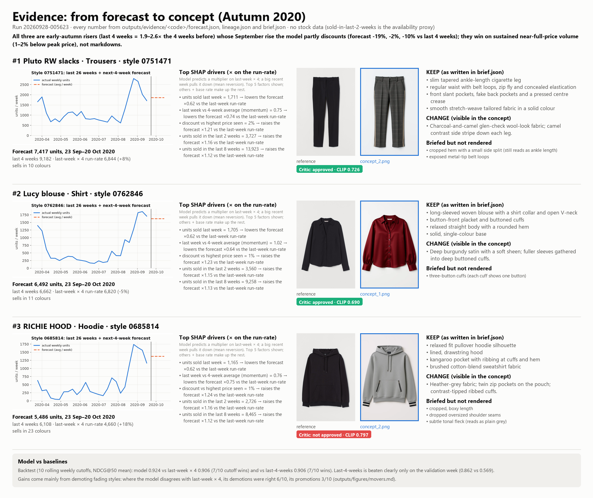
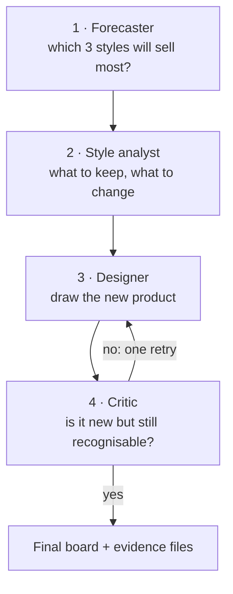

# Merchmix: next-season styles

Forecast next-season winning styles from H&M transactions, then generate new product concepts with an agent-based workflow.


**Evidence per winner:** sales curve, top SHAP drivers, reference → concept with critic verdict, KEEP/CHANGE,
and the backtest summary ([`outputs/evidence_sheet.png`](outputs/evidence_sheet.png)).



## Results

| # | Style | Forecast units, 23 Sep–20 Oct 2020 | What changed (visible in the concept) | Critic |
|---|---|---|---|---|
| 1 | Pluto RW slacks (trousers, `0751471`) | 7,417 | Charcoal-and-camel glen check; camel side stripe | approved |
| 2 | Lucy blouse (shirt, `0762846`) | 6,492 | Burgundy satin; fuller sleeves gathered into deep cuffs | approved |
| 3 | RICHIE HOOD (hoodie, `0685814`) | 5,486 | Heather-grey fabric; twin zip pockets; contrast-tipped cuffs | not approved |

The hoodie's intended cropped, boxy shape was not produced by the image model, so the critic did not approve it.
Full lineage per style: [`outputs/evidence/<code>/lineage.json`](outputs/evidence/).

## Model

- **Style** = `product_code` (all colourways of one design). **Target** = units sold in the next 4 weeks.
- **LightGBM** trained on 45 weekly snapshots, predicting the uplift over the naive "last week × 4" run-rate.
- **Backtest** (10 rolling weekly cutoffs, NDCG@50): model 0.924 vs 0.906 for both last-week × 4 and last-4-weeks,
  7/10 cutoff wins against each. Last-4-weeks is beaten clearly only on the validation week (0.862 vs 0.569).
  Where the model disagrees with last-week × 4, its demotions of fading styles were right 6/10, its promotions 3/10.

Details: [`outputs/figures/eval_table.md`](outputs/figures/eval_table.md), [`movers.md`](outputs/figures/movers.md), [WRITEUP.md](WRITEUP.md).

## How it works

One **orchestrator** agent runs four helper agents in order. Each helper can only use its own tools.



1. **Forecaster**: runs the LightGBM model on the sales data and picks the top 3 styles (one per garment group).
2. **Style analyst**: writes a short brief for each one: what made it sell (KEEP) and what to change, plus an
   image prompt. The rules for a good brief are a reusable **skill** (`style-dna-brief`).
3. **Designer**: edits the product photo with an image model (FLUX.1 Kontext) to create the new concept.
4. **Critic**: compares the new image with the original (CLIP similarity plus a visual check). It approves it or
   sends one revision note back to the designer.

The agents reach data and models through three **MCP servers** (`retail`, `forecast`, `image`). Every step is saved
in `outputs/evidence/<code>/lineage.json`, and every tool call in [`trace.jsonl`](outputs/runs/20260928-005623/trace.jsonl).

## Seasonal bonus

Same pipeline at a late-May cutoff: 7/10 of the predicted summer top-10 were in the actual top-10. From summer to
autumn, swimwear falls from 38% to 0% of the predicted top-100 and upper-body garments rise from 31% to 63%.
See [`outputs/figures/seasonal_comparison.md`](outputs/figures/seasonal_comparison.md).

## How to run (Windows PowerShell, Python 3.11)

```powershell
# 1. Setup
py -3.11 -m venv .venv; .venv\Scripts\pip install -r requirements.txt
copy .env.example .env        # add HF_TOKEN for real images (free Hugging Face account)

# 2. Data (needs a Kaggle API token and accepting the competition rules)
$c = "h-and-m-personalized-fashion-recommendations"
.venv\Scripts\kaggle competitions download -c $c -f transactions_train.csv -p raw
.venv\Scripts\kaggle competitions download -c $c -f articles.csv -p raw
.venv\Scripts\python scripts\convert_data.py --raw raw --out data

# 3. Forecast: training snapshots, model + evaluation, top-3 + evidence + reference photos
.venv\Scripts\python -m data_science.features
.venv\Scripts\python -m data_science.model
.venv\Scripts\python -m data_science.select
.venv\Scripts\python -m data_science.train      # winner classifiers + final scores (outputs/classifier/)
.venv\Scripts\python -m data_science.predict    # outputs/predictions.json for the API/frontend

# 4. Agent run: --mock uses a local stand-in instead of the image model (no image API key)
.venv\Scripts\python -m agents.orchestrator --cutoff 2020-09-22 --mock
.venv\Scripts\python -m agents.orchestrator --cutoff 2020-09-22

# 5. Finalize: lineage, review sheet, board (needs outputs/runs/<run_id>/captions.json), evidence sheet, tests
.venv\Scripts\python scripts\finalize_run.py --run <run_id> --final 0751471=concept_2.png 0762846=concept_1.png 0685814=concept_2.png
.venv\Scripts\python scripts\evidence_sheet.py --run <run_id>
.venv\Scripts\python -m pytest
```

The agents (step 4, including `--mock`) need Claude: `ANTHROPIC_API_KEY` in `.env` or a local Claude Code login.
Reference photos (`outputs/refs/`) are H&M/Kaggle data and are not included; step 3 downloads them.

## Repository layout

```
data_science/       data (DuckDB), features, regressor, winner classifier, evaluation, top-3 selection
  train.py          training pipeline (features → classifiers → final scores; --with-regressor for the rest)
  predict.py        writes outputs/predictions.json (scores, SHAP reasons, 26-week history, image paths)
  notebooks/        EDA script and the executed extended-EDA notebook
backend/            API service (next phase)
frontend/           user interface (next phase)
models/             LightGBM regressor/classifiers and isotonic calibrators
mcp_servers/        FastMCP servers: retail, forecast, image
agents/             orchestrator, in-process bookkeeping tools, sub-agent prompts
image/              image generation (HF Space / Replicate / mock) with quota guards, CLIP, board layout
skills_lib/         style-dna-brief template and validator (works without the SDK)
.claude/skills/     the style-dna-brief skill
scripts/            data conversion, MCP smoke test, image test, finalize, evidence sheet
tests/              leakage, NDCG, classification/calibration, quota guards, skill examples
outputs/            generated_concepts.png (= final board), predictions.json, classifier reports, evidence,
                    figures, agent run
```

## Limitations

- **No stock data.** "Sold in the last 2 weeks" is only a proxy for availability; sold-out styles look like weak sellers.
- **4-week horizon.** It covers the opening of autumn, not a full season; longer horizons were not validated.
- **Hoodie shape not achieved.** The image model changed fabric, colour and trims but not the garment's proportions.
- **CLIP is weak on colour.** Colourways of the same style score 0.80–0.94, so the critic also checks images visually.

More in [WRITEUP.md](WRITEUP.md) (also as [PDF](WRITEUP.pdf)): approach, why 4 weeks, full results, lineage, limitations, issues hit.
Evidence: [`outputs/evidence/`](outputs/evidence/) · agent run: [`outputs/runs/20260928-005623/`](outputs/runs/20260928-005623/).
