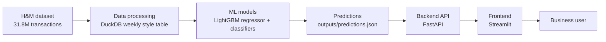
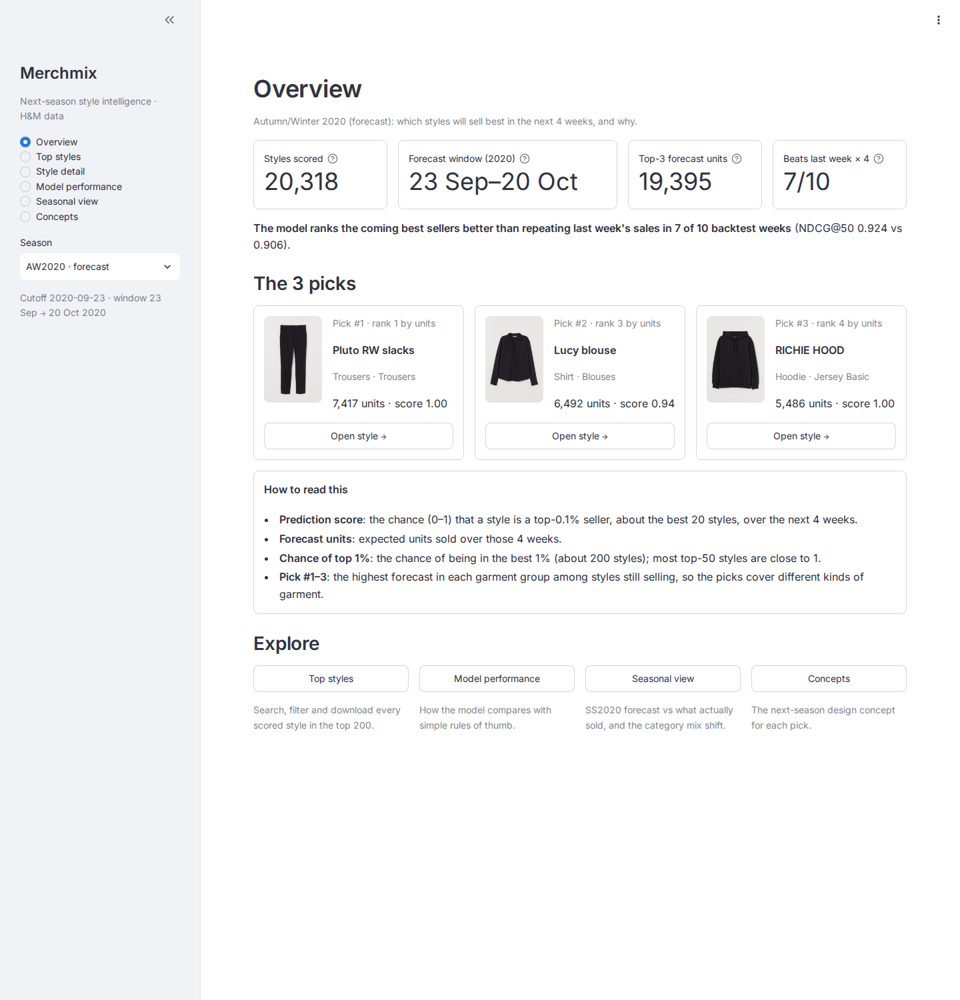
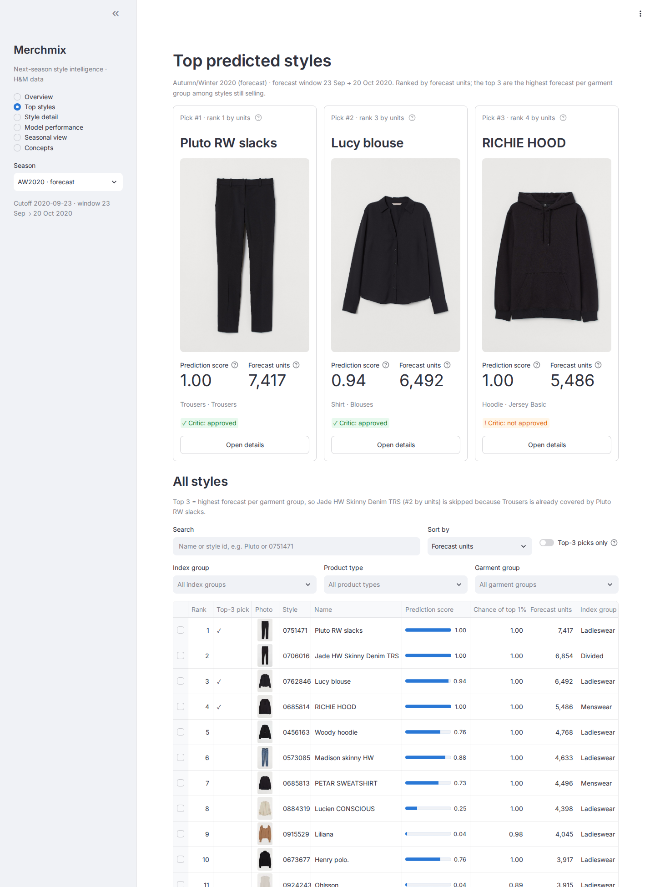
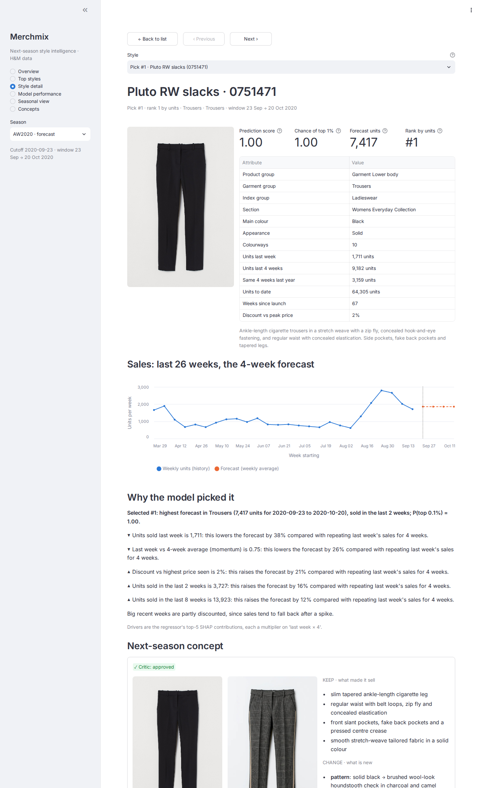
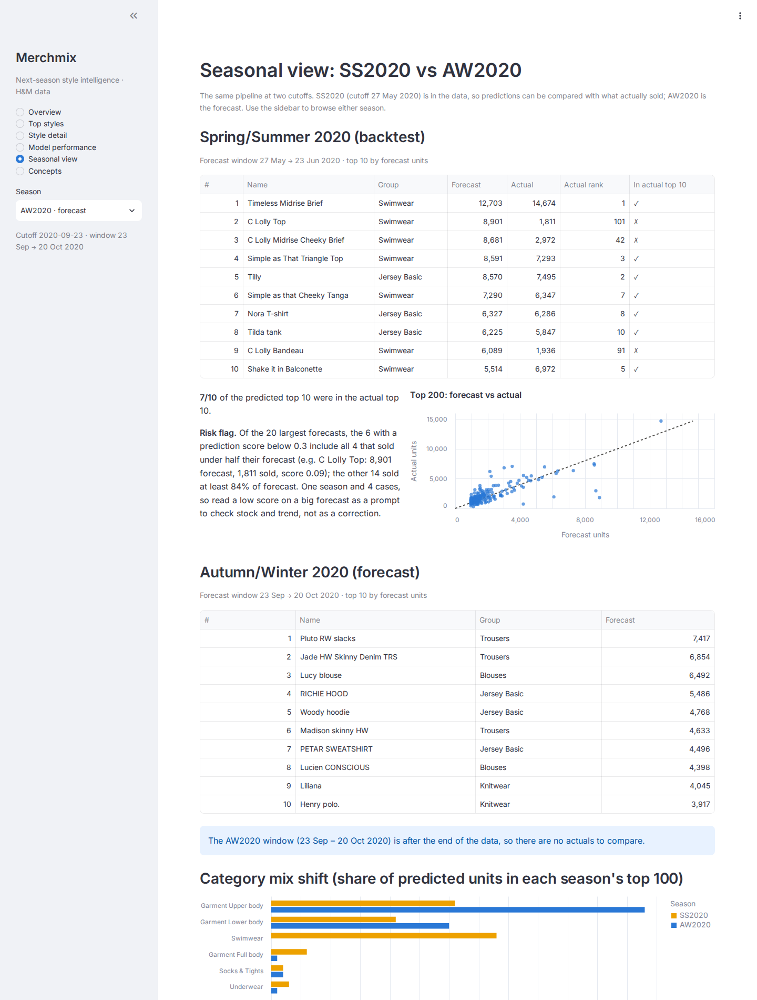

# Merchmix: next-season style intelligence (H&M data)

Predicts the three styles most likely to sell strongly in the next 4 weeks, turns each into a new product concept
with generative AI, and serves the results through a FastAPI backend and a Streamlit app.



## Results

Forecast window **23 Sep – 20 Oct 2020** (data ends 22 Sep). Ranked by forecast units, one style per garment group,
must have sold in the last 2 weeks. `prediction_score` = calibrated probability of being a top-0.1% seller.

| Rank | Style | prediction_score | Forecast units | Garment group | Concept (critic) |
|---|---|---|---|---|---|
| 1 | Pluto RW slacks `0751471` | 1.00 | 7,417 | Trousers | glen check, camel side stripe (approved) |
| 2 | Lucy blouse `0762846` | 0.94 | 6,492 | Blouses | burgundy satin, gathered sleeves (approved) |
| 3 | RICHIE HOOD `0685814` | 1.00 | 5,486 | Jersey Basic | grey, zip pockets, striped cuffs (**not approved**: shape unchanged) |


| Overview | Top styles | Style detail | Seasonal view |
|---|---|---|---|
|  |  |  |  |

Why each style was picked, with SHAP drivers and the concept lineage: [`outputs/evidence_sheet.png`](outputs/evidence_sheet.png).

## Model in brief

- **Style** = `product_code` (all colourways of one design; `style_id` = 7 digits, e.g. `0751471`).
- **Success** = units in the next 4 weeks in the **top 1% of active styles at that cutoff** (~194 of ~19,300).
- **Horizon** = 4 weeks: styles turn over fast (median 19 active weeks), so it is the longest window that can be
  tested honestly; from the 23 Sep cutoff it covers the opening of autumn.
- **Models** (LightGBM, 23 leakage-free features, 45 weekly training snapshots): a **regressor** forecasts units
  (as uplift over "last week × 4") and does the ranking; two **classifiers** (top 1%, top 0.1%) with isotonic
  calibration give the probabilities shown as scores.
- **Validation**: 10-cutoff rolling backtest (2020-05-27 → 2020-07-29) plus a validation week (cutoff 2020-08-26);
  every model is retrained only on cutoffs whose target ended before the scored cutoff.

| Backtest mean (10 cutoffs) | Model | Last week × 4 | Last 4 weeks |
|---|---|---|---|
| Regressor, NDCG@50 | **0.924** | 0.906 | 0.906 |
| Regressor, precision@12 | **0.725** | 0.708 | 0.658 |
| Classifier top 1%, PR-AUC | **0.770** | 0.738 | 0.713 |
| Classifier top 0.1%, PR-AUC | **0.807** | 0.750 | 0.743 |

Honest reading: the regressor wins 7/10 cutoffs on NDCG@50 but only ties last week × 4 on the validation week
(0.862 vs 0.864); the classifiers tie the regressor on ranking (PR-AUC 0.770 vs 0.771), so their value is a
calibrated probability. Sources: [`eval_table.md`](outputs/figures/eval_table.md),
[`eval_classifier.md`](outputs/classifier/eval_classifier.md), [`final_scores.md`](outputs/classifier/final_scores.md).

## Brief → where to find it

| Requirement | Where |
|---|---|
| EDA (trends, categories, seasonality, customers, data quality) | [`02_eda_extended.ipynb`](data_science/notebooks/02_eda_extended.ipynb), [`01_eda.py`](data_science/notebooks/01_eda.py), [`eda_insights.md`](outputs/figures/eda_insights.md) |
| Style, success and period definitions | [WRITEUP §1](WRITEUP.md#1-problem-definition), "Model in brief" above |
| Feature engineering | [`data_science/features.py`](data_science/features.py) |
| Time-aware validation, no leakage | [`model.py`](data_science/model.py) (rolling backtest), [`classify.py`](data_science/classify.py), [`test_features.py`](tests/test_features.py), [`test_classify.py`](tests/test_classify.py) |
| Baseline comparison | [`eval_table.md`](outputs/figures/eval_table.md), [`outputs/classifier/`](outputs/classifier/), Model performance page |
| Top 3 with scores and reasons | Results above, [`predictions.json`](outputs/predictions.json), [`evidence/`](outputs/evidence/), [WRITEUP §5](WRITEUP.md#5-top-3-and-why) |
| Concepts + linking explanation | [`generated_concepts.png`](outputs/generated_concepts.png), [`evidence_sheet.png`](outputs/evidence_sheet.png), [WRITEUP §6](WRITEUP.md#6-concepts-and-how-each-links-to-its-prediction) |
| Stock limitation + extra data | [WRITEUP §8](WRITEUP.md#8-limitations), Model performance page |
| Backend endpoints + 404 | [`backend/`](backend/), [API.md](API.md), [`test_api.py`](tests/test_api.py) |
| Frontend list / detail | [`frontend/app.py`](frontend/app.py), [screenshots](docs/screenshots/) |
| End-to-end flow | diagram above, [WRITEUP §7](WRITEUP.md#7-architecture) |
| Training / prediction pipeline | [`train.py`](data_science/train.py), [`predict.py`](data_science/predict.py) |
| API documentation | [API.md](API.md), `/docs` on the running API |
| Setup instructions | "How to run" below |
| Bonus: agentic workflow, seasonal view | "Bonus" below |

## How to run (Codespaces / Linux, Python 3.11)

```bash
python3.11 -m venv .venv && .venv/bin/pip install -r requirements.txt   # or: uv venv --python 3.11 .venv
cp .env.example .env                       # optional: HF_TOKEN (images), ANTHROPIC_API_KEY (agents)

# Data: needs a Kaggle API token and accepting the competition rules (~3.7 GB of CSVs, kept outside the repo)
c=h-and-m-personalized-fashion-recommendations
for f in transactions_train.csv articles.csv customers.csv; do .venv/bin/kaggle competitions download -c $c -f $f -p ../hm-data; done
.venv/bin/python scripts/convert_data.py --raw ../hm-data --out ../hm-data/data   # unzips, writes Parquet
export HM_DATA_DIR=$(realpath ../hm-data/data)

# Train and predict (the committed outputs already contain the results)
.venv/bin/python -m data_science.train                    # features + classifiers + final scores
.venv/bin/python -m data_science.predict                  # outputs/predictions.json (AW2020)
.venv/bin/python -m data_science.predict --season SS2020  # outputs/predictions_SS2020.json (backtest season)
.venv/bin/python -m data_science.summary                  # outputs/model_summary.json
.venv/bin/python scripts/fetch_list_photos.py --n 50      # optional: catalogue photos (Kaggle, not committed)
.venv/bin/python scripts/fetch_list_photos.py --n 50 --season SS2020   # same for the SS2020 backtest season

# App: two terminals
.venv/bin/uvicorn backend.api:app --host 0.0.0.0 --port 8000
API_URL=http://localhost:8000 .venv/bin/streamlit run frontend/app.py --server.address 0.0.0.0 --server.port 8501

.venv/bin/python -m pytest -q                             # data-dependent tests skip without the data
```

The API and app run from the committed `outputs/` alone, so no data download is needed to try them. Without the
photos, image URLs are `null` and the app shows placeholders. In a Codespace, open the **Ports** tab and click the
globe icon next to port **8501**; port 8000 does not need to be public. `python -m data_science.train --with-regressor`
also retrains the regressor (this rewrites the published evaluation files).

## API

| Method | Path | Returns |
|---|---|---|
| GET | `/styles/top?limit=10&offset=0&season=AW2020` | ranked styles: scores, category, 8-week sales, photo URL |
| GET | `/styles/{style_id}?season=AW2020` | product info, scores, SHAP reasons, 26-week history, concept (404 if unknown) |
| GET | `/seasons` | AW2020 (forecast) and SS2020 (backtest with actuals) |
| GET | `/model/summary` | model vs baselines, calibration, definitions |
| GET | `/health` | status, model version, cutoff, number of styles |
| GET | `/images/{path}` | photos, concepts, plots |

Full reference with examples and error cases: [API.md](API.md).

## Repository structure

```
data_science/            data processing, features, models, evaluation
  notebooks/             EDA (executed notebook + script)
  features.py            leakage-free weekly snapshot features
  train.py  predict.py   training pipeline, prediction files for the API
  model.py classify.py   regressor (+ backtest), winner classifiers + calibration
backend/                 api.py (HTTP), model_service.py (predictions), schemas.py
frontend/                app.py (Streamlit), api_client.py; theme in .streamlit/config.toml
models/                  LightGBM regressor/classifiers, isotonic calibrators
outputs/                 generated_concepts.png, predictions*.json, evidence/, figures/, classifier/
agents/ mcp_servers/ image/ skills_lib/ .claude/skills/   agentic concept workflow (bonus)
scripts/                 data conversion, photos, board/evidence sheet, screenshots
tests/                   leakage, metrics, calibration, API, frontend, agents
docs/screenshots/        app screenshots
```

## Bonus

**Agentic workflow.** An orchestrator (Claude Agent SDK) runs forecaster → style analyst → designer → critic
sub-agents through three MCP servers (`retail`, `forecast`, `image`) and a reusable `style-dna-brief` skill.
Guard-rails are in code (permission gate, image budget, one revision), and every step is logged in
[`outputs/evidence/<code>/lineage.json`](outputs/evidence/) and the [agent trace](outputs/runs/20260928-005623/).

**Seasonal view.** The same pipeline at the 27 May 2020 cutoff (SS2020) can be checked against what sold: 7/10 of
the predicted top 10 were in the actual top 10. From SS2020 to AW2020, swimwear falls from 38% to 0% of the
predicted top-100 and upper-body garments rise from 31% to 63%
([`seasonal_comparison.md`](outputs/figures/seasonal_comparison.md); Seasonal view page; `?season=SS2020` in the API).

## Limitations

- **No stock data:** sales are censored demand; a sold-out style looks like a weak seller. "Sold in the last 2 weeks" is the only availability proxy.
- **4-week horizon:** covers the opening of autumn, not a full season; longer horizons were not validated.
- **Cold start:** 32% of weekly units come from styles under 12 weeks old; brand-new styles cannot be ranked.
- **Ranking vs naive baseline:** gains over "last week × 4" are small and mostly come from demoting fading styles.
- **Image model:** fabric, colour and trims change well, but the hoodie's proportions did not (critic: not approved); CLIP is a weak novelty check.

Full write-up: [WRITEUP.md](WRITEUP.md) ([PDF](WRITEUP.pdf)).
