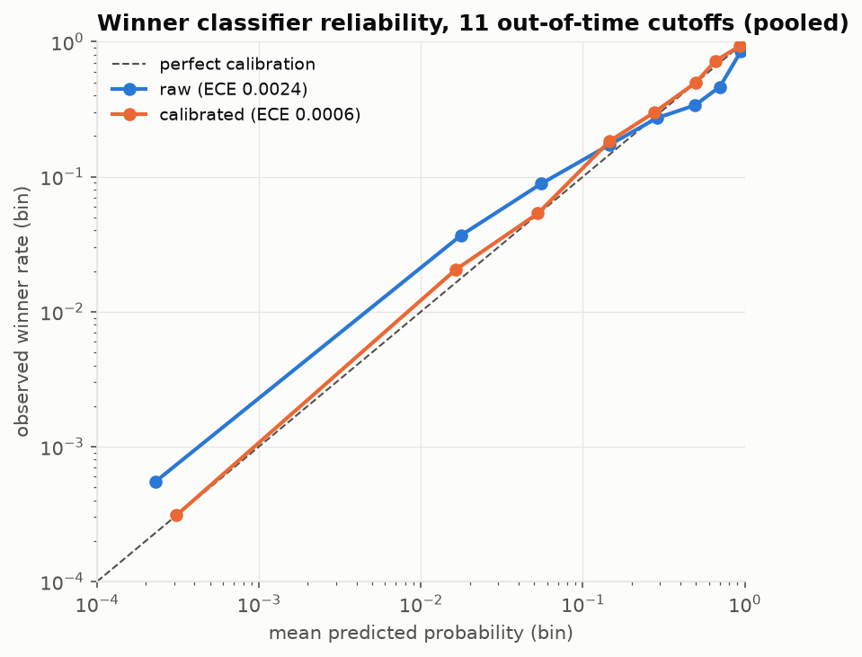
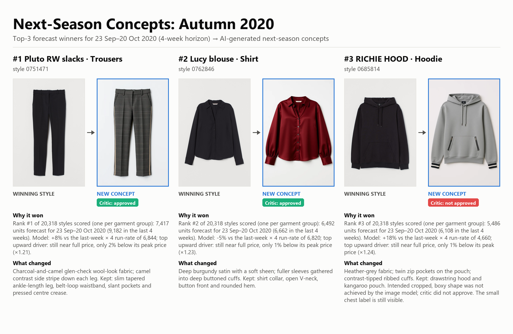
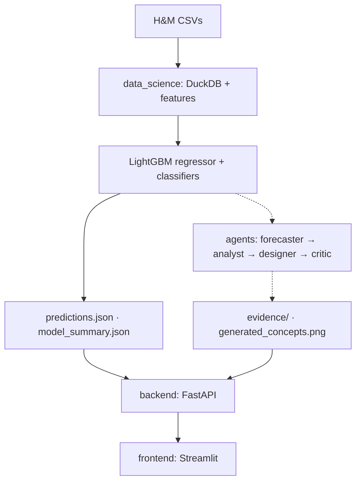

# Write-up: next-season style intelligence (H&M data)

**Deliverables:** top 3 in `outputs/predictions.json` · concepts in `outputs/generated_concepts.png` · evidence in
`outputs/evidence_sheet.png` and `outputs/evidence/<code>/` · API in `backend/` ([API.md](API.md)) · app in
`frontend/app.py`. Every number below comes from a committed output file, which is named next to it.

## 1. Problem definition

A fashion retailer wants to know which existing styles will lead next, and wants new products that build on them.

- **Style** = `product_code` (all colourways of one design; `style_id` = 7 digits). Colourways share the design
  "DNA"; ranking articles would return three colours of one trouser. The winners sell in 10–23 colours, which also
  shows that customers buy the *shape*, not the colour. `product_code` = `article_id // 1000` for every article, so
  the id is stable.
- **Success** = the style's units in the next 4 weeks rank in the **top 1% of styles active at that cutoff**
  (sold in the previous 12 weeks). The threshold is set per cutoff (857–1,512 units across the scored cutoffs;
  about 194 winners of ~19,300 styles). A rank-based threshold fits the decision, because a buyer reviews a
  short list, and it isn't distorted by seasonal swings or the 2020 COVID dip.
- **Prediction period** = the 4 weeks after the cutoff. Data ends 22 Sep 2020, so the forecast covers
  **23 Sep – 20 Oct 2020**, the opening of autumn. Styles turn over fast: the median style sells for 19 active
  weeks, and 32% of weekly units come from styles launched in the last 12 weeks. Over a 13-week season much of the
  demand comes from styles that don't exist yet, so 4 weeks is the longest window where "which existing styles
  will lead" is still well defined and testable. "Next season" is carried by the concepts, which are new products
  built on the winners' proven DNA.

## 2. Data & EDA

**Used in full:** all 31.8M transactions (20 Sep 2018 – 22 Sep 2020), 105,542 articles and 1.37M customers, kept
outside the repo and converted to Parquet. **Images:** only the 9 reference photos of the 3 winners, plus one list
photo per top-50 style for the app (the full set is about 30 GB). The forecast doesn't use images, so the ranking
is unaffected. The concepts only see each winner's best-selling colours.

Findings (`outputs/figures/eda_insights.md`, `data_science/notebooks/02_eda_extended.ipynb`):
- **Seasonality:** weekly units swing 3.6× (177k to 636k). Swimwear is 38% of the predicted summer top-100 and 0%
  in autumn.
- **Long tail:** in the last 52 weeks the top 1% of styles took 31% of units.
- **Newness:** 32% of weekly units come from styles under 12 weeks old (range 20–46%).
- **Customers:** age is bimodal (peaks at 21 and 51; 1.16% missing). Ages 25–34 buy 36.4% of units. Online is
  66.7–74.8% of units in every age band (69% → 73% from 2019 to 2020).
- **Data quality:**
  - *Duplicate rows:* 9.36% of transaction rows exactly repeat another row (same customer, day, article, price,
    channel). The raw CSV gives the same count, they occur on every day, and their frequency falls steeply with
    group size, which fits multiple units in one purchase. Each row is kept as one unit.
  - *Prices* are scaled by Kaggle (max ≈ 0.59). Within product type, 0.26% are low outliers and 0.04% high; they are
    kept.
  - *Coverage:* no missing dates. 995 articles never sold, and 0.39% of articles lack a description.

## 3. Approach & model selection

Transactions are aggregated with DuckDB to a weekly style table (Wed → Tue weeks). For each weekly cutoff, a
snapshot holds **23 features computed only from weeks before the cutoff**:
- momentum: units over 1/2/4/8/12 weeks, plus trend ratios;
- buyers, repeat rate and online share;
- price and discount vs peak price;
- weeks since launch and same period last year;
- six product attributes.

The target is units in the 4 weeks from the cutoff. There are 45 training snapshots (2019-09-25 → 2020-07-29),
and tests scramble future data to check that the features don't change.

- **Regressor for ranking.** LightGBM predicts `log1p(next 4 weeks) − log1p(4 × last week)`, the uplift over the
  naive run-rate, weighted toward high-volume styles. A plain log-units regressor lost to "last week × 4" at the top
  of the ranking, and a LambdaRank variant lost on the inner cutoffs (NDCG@50 0.846 vs 0.944). The regressor gives
  unit forecasts, which a merchandiser plans with, and it ranks the list.
- **Classifiers for calibrated scores.** Two LightGBM binary models (top 1% and top 0.1% labels) are trained on the
  same features and folds. Their probabilities are calibrated with isotonic maps fitted **only on out-of-fold
  predictions whose labels were known at each cutoff** (OOF cutoff ≤ cutoff − 4 weeks).
  - P(top 1%) saturates at 1.0 for 17 of the regressor's top 20 styles.
  - P(top 0.1%) spreads out (10 distinct values, 0.038–1.000), so it is the displayed `prediction_score`.
  - P(top 1%) is kept as `confidence_top1pct`.
- **Selection:** highest forecast units, at most one style per garment group, sold in the last 2 weeks (the only
  availability signal).

## 4. Results

Every model is retrained at each cutoff on cutoffs whose target ended before it: a 10-cutoff rolling backtest
(2020-05-27 → 2020-07-29) plus the validation week (cutoff 2020-08-26).

| Backtest mean (10 cutoffs) | Model | Last week × 4 | Last 4 weeks | Regressor |
|---|---|---|---|---|
| Regressor NDCG@50 | **0.924** ± 0.031 | 0.906 ± 0.040 | 0.906 ± 0.016 | – |
| Regressor precision@12 | **0.725** | 0.708 | 0.658 | – |
| Classifier top 1%, PR-AUC | 0.770 | 0.738 | 0.713 | **0.771** |
| Classifier top 0.1%, PR-AUC | **0.807** | 0.750 | 0.743 | 0.796 |

Sources: `outputs/figures/eval_table.md`, `outputs/classifier/eval_classifier.md`, `eval_classifier_top0.1pct.md`.

- **Regressor vs naive baselines:**
  - It wins 7/10 cutoffs on NDCG@50 against both baselines.
  - On precision@12 it beats last week × 4 at only 3/10 (6 ties).
  - On the validation week it **ties last week × 4** (NDCG@50 0.862 vs 0.864) and clearly beats last 4 weeks (0.569).
  - Its value is **demoting fading styles**: where it disagrees with last week × 4, its demotions were right 6/10,
    its promotions 3/10 (`outputs/figures/movers.md`).
- **Classifiers:**
  - They beat the naive baselines: top 1% is ahead of last week × 4 on PR-AUC at 9/10 cutoffs.
  - They **tie the regressor** (0.770 vs 0.771), so they don't rank better.
  - The top-0.1% model even loses to last week × 4 on the validation week (PR-AUC 0.456 vs 0.566). Its score is a
    relative-strength signal, not a better ranker.
- **Calibration:** isotonic lowers the top-1% ECE from 0.00361 to 0.00282 (backtest) and from 0.00271 to 0.00225
  (validation). For top 0.1% the change (0.00041 → 0.00044) is within noise (2 standard errors = 0.00006), and
  Brier improves at 8/11 cutoffs.

**Seasonal check (bonus):** the same pipeline at the 27 May 2020 cutoff put 7 of its predicted top 10 in the actual
top 10 (`outputs/figures/seasonal_comparison.md`). A low prediction score next to a large unit forecast was a
warning sign: of the 20 largest SS2020 forecasts, the 6 scored below 0.3 include all 4 that sold under half their
forecast (all C Lolly swimwear, e.g. C Lolly Top: 8,901 forecast, 1,811 sold, score 0.09), while the other 14 sold
at least 84% of forecast. This is one season and 4 cases, and lower in the list low scores also cover styles that
sold 2–3× their forecast (Kelso, Therese tee), so it is a flag to check stock and trend, not a correction.

## 5. Top 3 and why

| # | Style | Forecast (last 4 wks) | prediction_score | Main SHAP drivers (× on last week × 4) |
|---|---|---|---|---|
| 1 | Pluto RW slacks, Trousers | 7,417 (9,182) | 1.00 | last week 1,711 ×0.62 · momentum 0.75 ×0.74 · discount 2% ×1.21 · last 2 weeks ×1.16 |
| 2 | Lucy blouse, Blouses | 6,492 (6,662) | 0.94 | last week 1,705 ×0.62 · momentum 1.02 ×0.64 · discount 1% ×1.23 · last 2 weeks ×1.15 |
| 3 | RICHIE HOOD, Jersey Basic | 5,486 (6,108) | 1.00 | last week 1,165 ×0.62 · momentum 0.76 ×0.75 · discount 1% ×1.24 · last 2 weeks ×1.16 |

- **What they share:** all three are early-autumn risers (last 4 weeks = 1.9–2.6× the 4 weeks before) whose
  September rise the model partly discounts. They win on sustained volume at near full price (1–2% below peak),
  not markdowns.
- **Why perennial basics aren't there:**
  - Jade HW Skinny Denim (forecast rank 2) is a trouser, and Pluto has the higher forecast (7,417 vs 6,854).
  - Cat Tee is in RICHIE's garment group with far fewer forecast units (2,682, rank 29).
  - Long-running basics also teach the design team little that's new. That is a judgement, not a rule: RICHIE has
    sold for 97 weeks too.

Per-style drivers, history and lineage: `outputs/evidence/<code>/forecast.json` and the app's Style detail page.

## 6. Concepts and how each links to its prediction

**How each concept is built.** For each winner, the brief (`brief.json`) KEEPs what the data says sells and CHANGEs
fabric, colour, trims or proportion.
- *KEEP:* the shape that sells across colourways, the details visible in the photos and description, and the
  near-full-price quality.
- *Image:* FLUX.1 Kontext edits the best-selling colourway's photo.
- *Critic:* checks novelty with CLIP similarity to the style's own photos, plus a visual check.
- *Lineage:* `lineage.json` links forecast → brief → prompt → critic → board caption, and lists briefed changes the
  image didn't render.

| Winner | Why it won (forecast) | Concept | Critic | CLIP to own photos |
|---|---|---|---|---|
| Pluto RW slacks | 7,417 units; near full price | glen check, camel side stripe | approved | 0.726 |
| Lucy blouse | 6,492 units; near full price | burgundy satin, fuller gathered sleeves | approved | 0.690 |
| RICHIE HOOD | 5,486 units; near full price | grey, zip pockets, striped cuffs | **not approved** | 0.797 |

**RICHIE:** the brief asked for a cropped, boxy shape, which the image model never produced in three attempts, so
the board says the critic did not approve it. **Pluto:** it was regenerated from the run's own brief so that its
lineage is clean. Both interventions were approved by the user and logged.

## 7. Architecture

- **data_science/:** data layer, features, regressor with backtest (`model.py`), classifiers and calibration
  (`classify.py`). `train.py` runs the pipeline; `predict.py` and `summary.py` write the JSON files the API serves.
  Nothing in the API retrains.
- **backend/:** `model_service.py` loads the predictions once and has no web code; `api.py` handles HTTP only
  (validation, 404/422 JSON, CORS, images); `schemas.py` holds the Pydantic models.
  - Endpoints: `/styles/top`, `/styles/{id}`, `/seasons`, `/model/summary`, `/health`, `/images`.
- **frontend/:** Streamlit, talking only to the API; images are fetched server-side.
  - Pages: overview (KPIs, the 3 picks, how to read the scores), top styles (search, filters, CSV download), style
    detail (chart, reasons, concept, previous/next), model performance, seasonal view, concepts.
- **Agentic layer (bonus):** a Claude Agent SDK orchestrator with 4 sub-agents, 3 MCP servers (`retail`,
  `forecast`, `image`) and the `style-dna-brief` skill.
  - Guard-rails are in code: a permission gate (writes only under `outputs/`), an image budget (≤ 4 new images,
    ≤ 1 revision), and lineage built from files.
  - The run took 7 minutes: 59 tool calls and 3 GPU generations.

## 8. Limitations

- **No stock data → censored demand.** A sold-out style looks like a weak seller, so the model learns supply-limited
  styles as decliners. "Sold in the last 2 weeks" only removes styles that are clearly gone; no inventory
  assumptions were added. **Data that would help:**
  - stock and availability by store/size;
  - the markdown calendar and promotions;
  - returns;
  - web traffic (views, add-to-cart, searches);
  - store footfall;
  - size curves.
- **Horizon:** validated for 4 weeks only. A season-long forecast was not tested, so no accuracy claim is made for it.
- **Cold start:** new styles have no history, and 32% of units come from them. Only existing styles can be ranked.
- **Small gains over the naive baseline:** last week × 4 is strong, and 2020 is COVID-distorted.
- **Images:** FLUX Kontext changes fabric, colour and trims, but didn't change the hoodie's proportions, and small
  chest labels reappear. CLIP barely reacts to colour (colourways of one style score 0.80–0.94), so the critic also
  checks images visually. The brief validator doesn't catch KEEP-vs-CHANGE contradictions (Pluto KEEPs "solid
  colour" while changing to a check).

## 9. Future improvements

- **Stock-aware selection:** plug in inventory and open-to-buy, and model demand as censored.
- **Cold start:** attribute-similarity to past launches, so new styles can be scored.
- **Longer horizons:** a season-level forecast with its own backtest.
- **Concepts:** a shape check in the critic (silhouette/edge comparison) instead of relying on CLIP.
- **Workflow:** route concepts to a buyer approval queue with the lineage attached.
- **Monitoring:** retrain weekly and track calibration drift.
